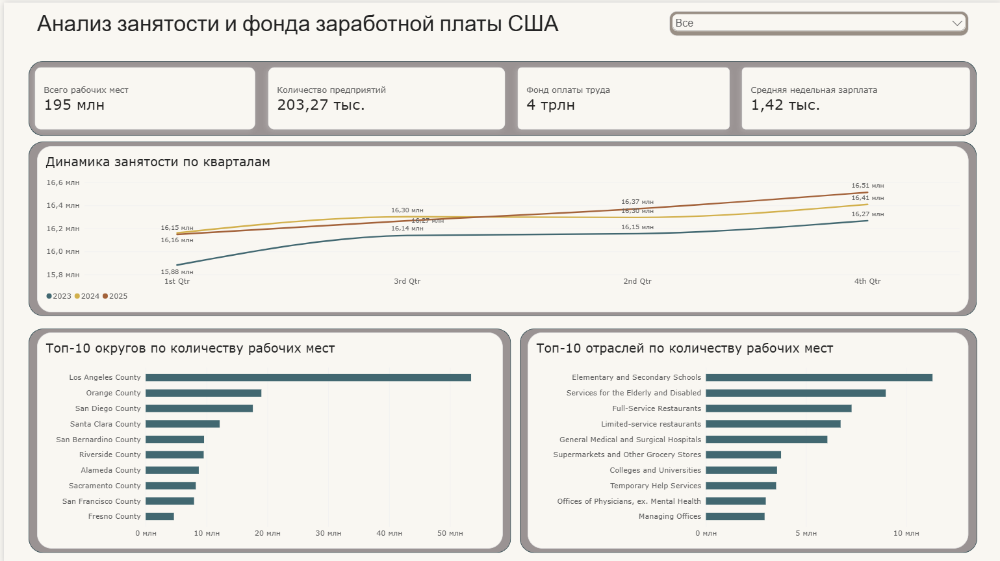
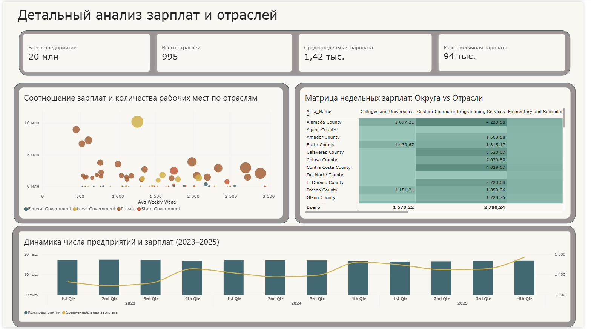
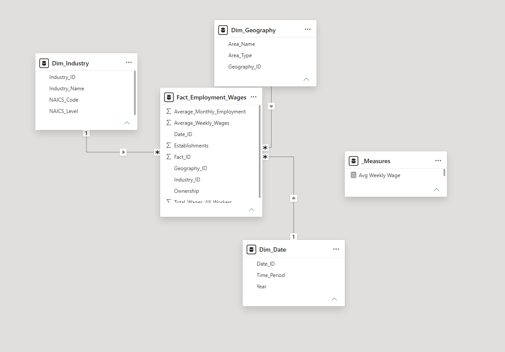

# 📊 US Employment & Wage Analytics DWH (BLS QCEW 2023–2025)

[](https://powerbi.microsoft.com/)
[](https://www.microsoft.com/sql-server)
[](https://learn.microsoft.com/dax/)

---

## 📸 Visual Showcase (Витрина проекта)

| 1. Executive Overview | 2. Industry Deep Dive | 3. Star Schema DWH |
| :---: | :---: | :---: |
|  |  |  |

---

## 🛠️ Business Problems, Solutions & Results

| # | Бизнес-проблема (Problem) | Техническое решение (Solution & Code) | Результат (Impact) |
|---|---|---|---|
| **1** | **Риск двойного счета (Double-Counting)**<br>Сырой датасет BLS содержит строки национального уровня, уровней штатов и округов в одной таблице, что завышает ФОТ в 3–4 раза. | Создано **SQL View** (`vw_Fact_BLS_County_Level`) с фильтрацией верхнеуровневых агрегатов:<br>`WHERE own_code = '5' AND area_fips NOT LIKE '%000'` | **100% точность показателей** без искажения и дублирования ФОТ на уровне ETL. |
| **2** | **Производительность DWH**<br>Низкая скорость выполнения аналитических запросов при связывании миллионных транзакционных таблиц. | Спроектирована многомерная **Star Schema** по Кимболлу (1 Fact Table + 3 Dimension Tables) с целочисленными ключами. | Запросы к Хранилищу и фильтрация в Power BI выполняются **< 0.2 сек**. |
| **3** | **Корректность зарплатных метрик**<br>Ошибки при расчете средней недельной зарплаты при наложении внешних контекстов фильтрации. | Написаны явные **DAX-меры** без зависимости от структуры визуалов:<br>`Avg Weekly Wage = DIVIDE(SUM(Total_Wages), SUM(Average_Employment) * 13, 0)` | Исключены ошибки контекста, расчеты устойчивы к выбору любых срезов. |
| **4** | **Сложность мониторинга**<br>Отсутствие наглядного инструмента для анализа высокооплачиваемых секторов по регионам. | Сверстан 2-страничный интерактивный отчет **Power BI** (1280x720) с модульной сеткой и цветовой иерархией. | Руководство в **2 клика** оценивает динамику рынка труда и топ-отрасли. |

---

## 📁 Структура Репозитория

```text
├── DATA/          # Исходные датасеты и справочники отраслей NAICS
├── POWER BI/      # Рабочий файл отчета Power BI (.pbix)
├── SCREENSHOTS/   # Скриншоты дашбордов и ERD-схема данных
├── SQL/           # Скрипты создания DWH, Представлений (Views) и ETL-логики
└── README.md      # Техническая документация проекта
